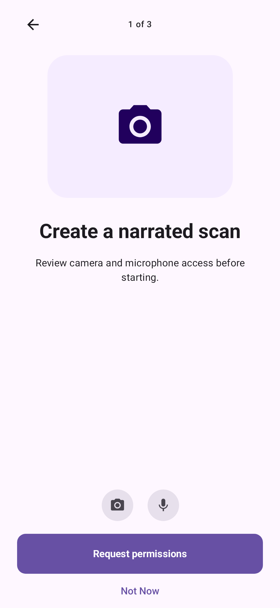
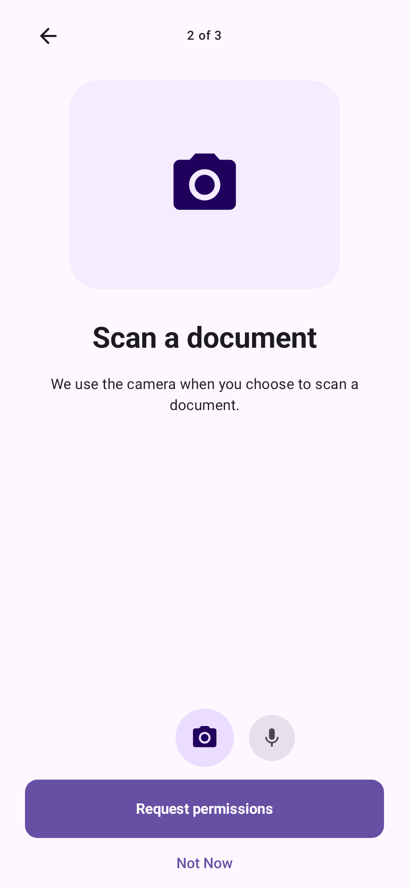
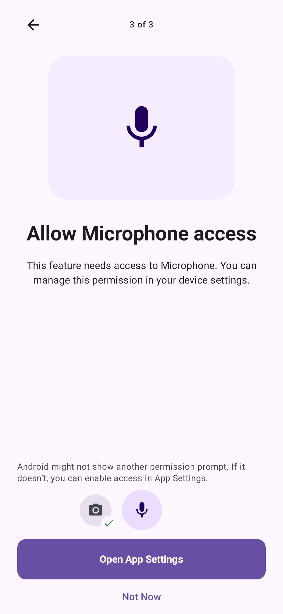
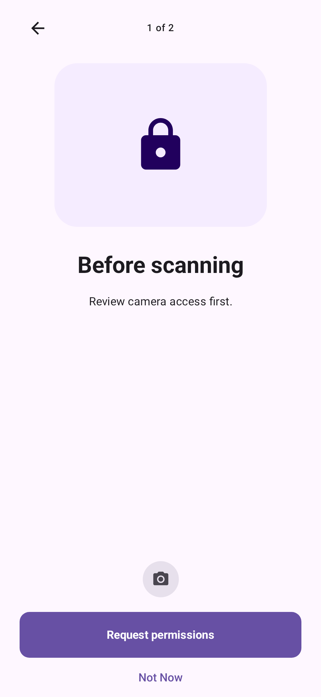
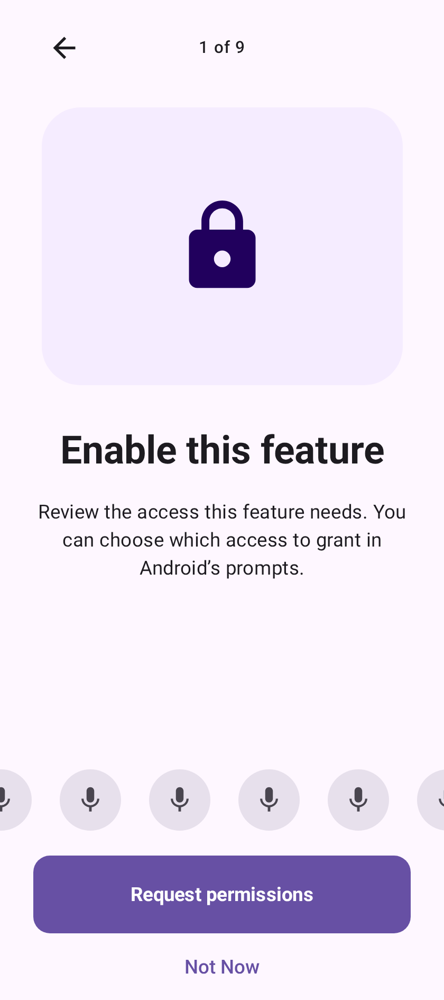
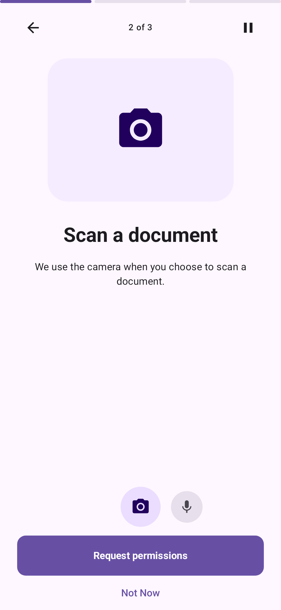

# Android runtime permissions for Compose

A Compose library for explaining and requesting a set of Android runtime permissions. The main `HandlePermissions` entry point requests the set together after one button tap. Android may show several system prompts and grant only some permissions.

The [library site](https://lambdawalker.github.io/android.apexfission.permissions/) has a short path through installation, Compose examples, callback recipes, and a screenshot gallery. Its source lives in [`sites/`](sites/README.md); `docs/` holds repository documentation and the original screenshot fixtures.

## Screenshots

| Bundle overview | Selected permission | Settings recovery |
| --- | --- | --- |
|  |  |  |

| Single permission with overview | Multiple permissions without overview | Overflowing icon strip |
| --- | --- | --- |
|  |  |  |

With autoplay enabled, the bar at the top has one segment per visible page. Completed pages are filled; the current segment tracks its reading time. Pausing fades the bar without losing the time already elapsed.



These are static Compose previews generated by the [screenshot tests](permission/src/screenshotTest/kotlin/com/apexfission/android/permission/PermissionBundleScreenshotTest.kt). They show library UI rather than Android's system permission dialogs. See [screenshot sources and refresh steps](docs/screenshots/README.md).

## Install

Once the first release has been published on Maven Central, use:

```kotlin
// settings.gradle.kts: ensure mavenCentral() is in dependencyResolutionManagement repositories
dependencies {
    implementation("com.apexfission.androi:permission:0.1.0")
}
```

For a source checkout, include the module and use:

```kotlin
dependencies { implementation(project(":permission")) }
```

The module is `:permission` (namespace `com.apexfission.android.permission`, minSdk 24). The published version is chosen when the release workflow runs; replace `0.1.0` above with the version actually published. Declare every requested permission in your app manifest:

```xml
<uses-permission android:name="android.permission.CAMERA" />
<uses-permission android:name="android.permission.RECORD_AUDIO" />
```

## Request a group

The sample app has [emulator instrumentation tests](app/src/androidTest/java/com/apexfission/android/permissions/) for real permission denial and Settings recovery, platform recipe grant transitions, and both demo routes. Run `./gradlew :app:connectedDebugAndroidTest` on an attached device, or use the [Device permission tests workflow](.github/workflows/device-permission-tests.yml) for API 29 and 35 emulators.

The following is a complete Activity example. The permissions are checked on composition; the system request starts only after the user taps the action button.

```kotlin
class MainActivity : ComponentActivity() {
    override fun onCreate(savedInstanceState: Bundle?) {
        super.onCreate(savedInstanceState)
        setContent {
            MaterialTheme {
                HandlePermissions(
                    permissions = listOf(
                        PermissionDescription(
                            permission = Manifest.permission.CAMERA,
                        ) {
                            DefaultPermissionPage(
                                label = "Camera",
                                icon = Icons.Default.PhotoCamera,
                                title = "Scan documents",
                                body = "Allow camera access when you start a scan.",
                            )
                        },
                        PermissionDescription(
                            permission = Manifest.permission.RECORD_AUDIO,
                        ) {
                            DefaultPermissionPage("Microphone", Icons.Default.Mic)
                        },
                    ),
                    overview = PermissionOverview(page = {
                        DefaultPermissionPage(
                            label = "Access",
                            icon = Icons.Default.Lock,
                            title = "Prepare your scan",
                            body = "Review the access needed before continuing.",
                        )
                    }),
                    displayMode = PermissionDisplayMode.All, // or MissingOnly
                    overviewMode = PermissionOverviewMode.Automatic, // or Show / Hide
                    onBack = { finish() },
                    onNotNow = { finish() },
                ) {
                    Text("Ready to scan")
                }
            }
        }
    }
}
```

Imports: `android.Manifest`, `android.os.Bundle`, `androidx.activity.ComponentActivity`, `androidx.activity.compose.setContent`, Compose Material icons (`Icons`, `PhotoCamera`, `Mic`, `Lock`), `MaterialTheme`, `Text`, and the public types from `com.apexfission.android.permission`. Run the sample app to choose between the [carousel demo](app/src/main/java/com/apexfission/android/permissions/demo/PermissionCarouselDemo.kt) and the [platform recipes demo](app/src/main/java/com/apexfission/android/permissions/demo/PlatformRecipesDemo.kt). [MainActivity](app/src/main/java/com/apexfission/android/permissions/MainActivity.kt) only hosts the demo navigation.

By default, multiple visible permissions start on a general feature overview and then show one page per permission. A single visible permission starts on its permission page. `overviewMode = PermissionOverviewMode.Show` includes the overview even for one permission; `PermissionOverviewMode.Hide` omits it even for several. `Automatic` (the default) follows the number of visible permissions. Supplying `overview` customizes its content; `overviewMode` decides whether it appears.

Every `PermissionDescription` requires a full page composable. `DefaultPermissionPage` is an optional helper for a ready-made hero and text; otherwise compose any UI you want. The persistent icon selector reads `PermissionDescription.label` as its accessibility name. `label` and `icon` default to permission-specific metadata for common Android runtime permissions (camera, microphone, location, notifications, media, and more). Unknown strings use a readable name and lock icon. Override either property when your feature needs a different name or icon, especially for localized accessibility text. Use `PermissionVisualDefaults.forPermission(permission)` if you want the same visual inside your page. The screen owns request and recovery actions; the page only supplies explanation content. The separate `PermissionOverview` remains optional and has its own fallback.

### Replace the default page with your own Compose UI

The trailing lambda can render **any** composable, so you do not have to call `DefaultPermissionPage`. The [carousel demo](app/src/main/java/com/apexfission/android/permissions/demo/PermissionCarouselDemo.kt) uses the default camera page and this custom microphone page together:

```kotlin
val narrationTitle = "Record narration"
val narrationBody = "Allow microphone access to add narration when you record a scan."

PermissionDescription(
    permission = Manifest.permission.RECORD_AUDIO,
    required = false,
    autoAdvanceDelayMillis = estimateReadingDelayMillis(
        "$narrationTitle $narrationBody", ReadingPace.Slow
    ),
) {
    NarrationPermissionPage(narrationTitle, narrationBody)
}

@Composable
fun NarrationPermissionPage(title: String, body: String) {
    Column(horizontalAlignment = Alignment.CenterHorizontally) {
        Box(
            Modifier.fillMaxWidth().height(210.dp)
                .background(MaterialTheme.colorScheme.secondaryContainer, RoundedCornerShape(28.dp)),
            contentAlignment = Alignment.Center,
        ) {
            Icon(Icons.Default.Mic, contentDescription = null, modifier = Modifier.size(52.dp))
        }
        Spacer(Modifier.height(24.dp))
        Text(title, style = MaterialTheme.typography.headlineMedium, textAlign = TextAlign.Center)
        Text(body, style = MaterialTheme.typography.bodyLarge, textAlign = TextAlign.Center)
    }
}
```

Add the standard Compose layout, shape, Material 3, and `TextAlign` imports. The library still draws the persistent icon strip, progress indicator, recovery note, and batch action around this page. Keep the text used for `estimateReadingDelayMillis` in sync with the words you actually render. The custom page is Compose UI only; it does not request permission itself.

The icon strip stays above the primary button while pages swipe. It scrolls to center the selected permission; on the overview, the whole icon set is centered, with extra icons clipped equally at either side of the screen. The button requests the permissions as one batch regardless of the carousel page.

### Optional timed carousel

Set `autoAdvance = true` on `HandlePermissions` (or `HandlePermissionBundle`) to advance from the overview through the permission pages. A full-width progress bar above the header shows the time elapsed on the current page. When the final page's time ends, the carousel returns to the first page and repeats. The header button pauses and resumes automatic pages; touching, swiping, scrolling, or selecting a permission icon pauses them until the reader resumes. A single-page screen does not advance. The timer pauses when the host is not resumed and is disabled while Android touch exploration is enabled. The default is `false`.

The library does not inspect arbitrary composable text. Set each page's `autoAdvanceDelayMillis` explicitly, using the public helper when the copy is known:

```kotlin
val title = "Scan documents"
val body = "Allow camera access when you start a scan."

PermissionDescription(
    permission = Manifest.permission.CAMERA,
    label = "Camera",
    icon = Icons.Default.PhotoCamera,
    autoAdvanceDelayMillis = estimateReadingDelayMillis("$title $body", ReadingPace.Slow),
) {
    DefaultPermissionPage("Camera", Icons.Default.PhotoCamera, title = title, body = body)
}
```

`PermissionOverview` also accepts `autoAdvanceDelayMillis`. Unspecified delays are six seconds. `ReadingPace.Slow` (120 words/minute), `Normal` (180), and `Fast` (230) estimate from whitespace-separated words, add two seconds of orientation time, and clamp to 4–60 seconds. For text without word separators or image-heavy pages, choose the delay directly. The [carousel demo](app/src/main/java/com/apexfission/android/permissions/demo/PermissionCarouselDemo.kt) uses the same title and body values for UI and timing.

`displayMode = PermissionDisplayMode.All` (the default) keeps granted permissions in the carousel and marks their icons with a green check badge; selecting one still highlights its icon. `PermissionDisplayMode.MissingOnly` removes granted permissions from both the carousel and icon strip. In `Automatic` overview mode, the overview appears only while more than one **visible** permission remains. After a grant changes the visible set, the carousel starts on the overview if present, otherwise the first remaining permission. Both modes still gate protected content on every original permission and use the same batch request. The setting applies to the built-in UI; custom `permissionContent` receives all controllers.

`content` appears when every **required** permission is granted. On a partial grant that still lacks a required permission, the screen remains and the button requests missing permissions; if none can prompt, it offers app settings. The `PermanentlyDenied` status is inferred from request history and Android's rationale signal, not a definitive platform flag. The built-in UI therefore says Android *might* skip another prompt. The request callback can be observed with `HandlePermissionBundle(onPermissionsResult = { ... })` when needed.

Customize the recovery note and Settings route for your feature:

```kotlin
HandlePermissions(
    permissions = listOf(PermissionDescription(Manifest.permission.CAMERA) {
        DefaultPermissionPage("Camera", Icons.Default.PhotoCamera)
    }),
    onBack = { finish() },
    onNotNow = { finish() },
    recoveryContent = { inferredPermissions ->
        Text("Android may skip the prompt. You can enable camera access in Settings.")
    },
    settingsActionLabel = "Review camera access",
    onOpenSettings = { showCameraSettingsExplanation() },
) { grants -> CameraFeature() }
```

`recoveryContent` receives the permission strings whose status is *inferred* to need recovery; it appears even if another missing permission can still be requested. The callback `onOpenSettings` replaces the default app-details launch and runs only after the user taps the Settings action. A host can show an explanation and a decline choice there before opening Settings. `PermissionBundleScreen` and `PermissionScreen` expose the same recovery content and label hooks; their existing `onOpenSettings` callbacks remain the action. Custom `permissionContent` owns its entire UI and can use each `PermissionController.status` and `openAppSettings()` directly. Never assume this status proves the system cannot show another request.

### Required and optional access

Permissions are required by default. Set `required = false` when the feature can still work without one. The bundle action requests all missing permissions together while the explanation screen is visible, and the optional page is marked “Optional access.” Protected content receives a current `PermissionGrants` snapshot:

```kotlin
HandlePermissions(
    permissions = listOf(
        PermissionDescription(Manifest.permission.CAMERA) {
            DefaultPermissionPage("Camera", Icons.Default.PhotoCamera)
        },
        PermissionDescription(Manifest.permission.RECORD_AUDIO, required = false) {
            DefaultPermissionPage("Microphone", Icons.Default.Mic)
        },
    ),
    onBack = { finish() },
    onNotNow = { finish() },
) { grants ->
    Scanner(enableNarration = grants.isGranted(Manifest.permission.RECORD_AUDIO))
}
```

`grants.canProceed`, `grants.missingRequired`, `grants.missingOptional`, and `grants.statusByPermission` are also available. If all required permissions were already granted, content appears immediately; optional access is **not** requested on its own. To offer it later, launch a separate permission request when the user chooses that capability. An all-optional list likewise shows content immediately. Grants can change outside the app, so use the current snapshot instead of caching it.

For a single permission, the same API skips the overview page by default; use `overviewMode = PermissionOverviewMode.Show` to include it. `HandlePermissionsIndividually` remains available for intentionally sequential integrations. `PermissionScreen` and `PermissionBundleScreen` can render host-managed statuses and actions without launching requests themselves. The `permissionContent` parameter of `HandlePermissions` preserves its existing controller-driven custom UI path.

The launcher handles ordinary Android runtime permissions. Special app access (exact alarms, overlay, all-files access) and runtime permissions with platform-specific sequencing (such as background location) need their own host flow. Do not assume the batch is atomic or that Android will present exactly one system dialog.

### Platform-aware recipes

`PermissionRecipes` computes the next host action for foreground location, separately staged background location, and notifications. A step is `Ready`, `RequestRuntime(permissions)`, `OpenAppSettings`, or `SystemControlledPrompt`. The host shows its explanation and launches the returned action after a user gesture, then calls the recipe again after the result. For example:

```kotlin
when (val step = PermissionRecipes.foregroundLocation(this, LocationAccuracy.Precise)) {
    is PermissionRecipeStep.RequestRuntime -> with(permissionRequester) {
        requestPermissions(*step.permissions.toTypedArray()) {
            useLocation(PermissionRecipes.grantedLocationAccuracy(this@MainActivity))
        } onDenied { missing -> showLocationExplanation(missing) }
    }
    PermissionRecipeStep.Ready -> useLocation(PermissionRecipes.grantedLocationAccuracy(this))
    PermissionRecipeStep.OpenAppSettings -> openPermissionRecipeSettings()
    PermissionRecipeStep.SystemControlledPrompt -> Unit
}
```

`PermissionRequester` is an Activity property; `useLocation` and `showLocationExplanation` are host functions. On Android 10 the background recipe requests background access **after** foreground is granted; on Android 11+ it points to Settings after a host-provided explanation. Notifications have a runtime prompt on Android 13+ with target SDK 33+. For user-selected photos or videos, use `rememberVisualMediaPicker { uri -> ... }` and launch it on a user gesture instead of requesting a storage permission. See the [complete platform recipes](agents/platform-recipes.md) for manifest setup, photo-picker code, and edge cases.

The app's [platform recipes screen](app/src/main/java/com/apexfission/android/permissions/demo/PlatformRecipesDemo.kt) runs each of these paths: approximate and precise location, staged background location, notifications, and photo/video selection. It displays the next recipe step, waits for a tap before requesting access, explains Settings and background steps with a decline option, and refreshes status after a request or return from Settings. Its manifest declares the permissions used by the demo. A real host should request background access only for an actual background feature.

## Code-only request with callbacks

For a flow with no library screen, create a `PermissionRequester` as an Activity property so the Android result launcher is registered before the Activity starts. The infix `onDenied` call is **terminal**: it attaches the handler and starts the request. The library checks current grants first, then rechecks after Android returns. One request may be outstanding at a time.

```kotlin
class ScannerActivity : ComponentActivity() {
    private val permissionRequester = PermissionRequester(this)

    private fun startScanner() = with(permissionRequester) {
        requestPermissions(
            Manifest.permission.CAMERA,
            Manifest.permission.RECORD_AUDIO,
        ) {
            openScanner() // all granted now, or granted after the prompt
        } onDenied { missing ->
            showDeniedState(missing)
        }
    }

    // Call startScanner() from a user action such as a button tap.
    private fun openScanner() { /* use the protected feature */ }
    private fun showDeniedState(missing: List<String>) { /* host UI or settings route */ }
}
```

`requestPermissions(...) { ... }` only builds the pending call. The prompt starts when `onDenied` is attached, so even an immediate result has both callbacks ready. If all permissions are already granted, `openScanner()` runs synchronously at that terminal call. The callbacks are held in memory; after Activity recreation or process death, recheck and retry the user action rather than assuming an old callback will continue. The requester supports ordinary runtime permissions, not special app access or permissions that need staged platform flows.

## Code-only permission check

Use `runIfPermissionsGranted` when the host wants to handle its own request flow without a library screen. It accepts either varargs or a `List<String>` and returns the missing permission names to `otherwise`:

```kotlin
private val permissionLauncher = registerForActivityResult(
    ActivityResultContracts.RequestMultiplePermissions()
) { grants ->
    if (grants.isNotEmpty() && grants.values.all { it }) startFeature() // recheck
    else showDeniedState()
}

private fun startFeature() {
    runIfPermissionsGranted(
        Manifest.permission.CAMERA,
        Manifest.permission.RECORD_AUDIO,
    ) {
        doSomething()
    } otherwise { missing ->
        permissionLauncher.launch(missing.toTypedArray())
    }
}
```

This is a `Context` extension, so the **check** works in any class holding a valid `Context`. The **request** still needs an Activity, Fragment, or Compose-owned result launcher and an appropriate lifecycle. The check is synchronous; requesting is asynchronous. Recheck after a successful callback, and handle denial separately to avoid repeatedly launching the prompt. This helper does not render an explanation or manage special app access.

## Screenshots and checks

Run `./gradlew :permission:testDebugUnitTest :permission:updateDebugScreenshotTest :permission:generatePomFileForMavenPublication :app:assembleDebug`. [GitHub Actions](.github/workflows/render-permission-screens.yml) renders Compose previews, checks the publication POM, and uploads the PNGs. The previews do not exercise Android system permission prompts; validate grant and denial paths on a device or emulator.

See [the bundle guide](docs/batch-request.md), [AGENTS.md](AGENTS.md), and [LICENSE](LICENSE).
